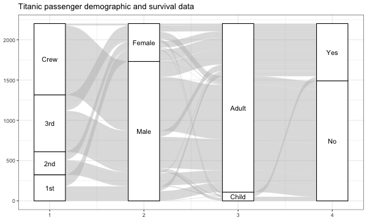
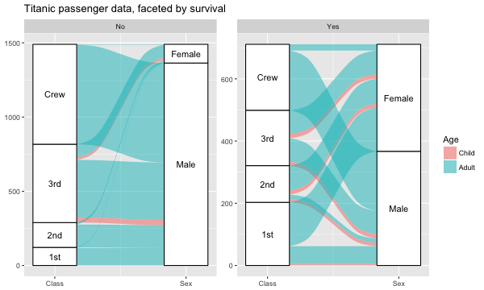
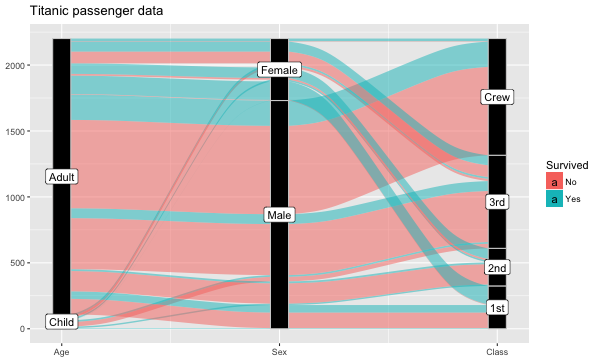
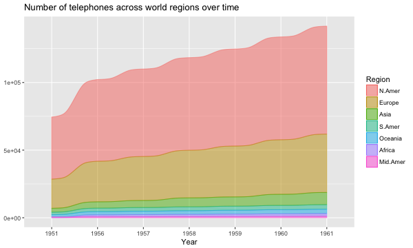
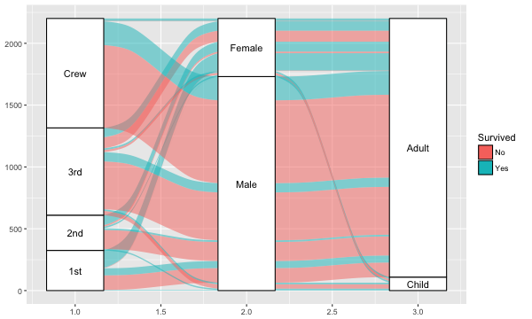

# ggalluvial

A ggplot2 extension for alluvial diagrams, which visualize frequency tables in several dimensions.

## Background

While alluvial plots are most popularly used to visualize frequency distributions over time, i usually use them to visualize frequency tables involving several categorical variables.

I've relied for several tasks on [mbojan](https://github.com/mbojan)'s timely [alluvial](https://github.com/mbojan/alluvial) package, from which much of the alluvial infrastructure used here is derived. Besides being tailored to ggplot2, there are several conspicuous differences between these packages:

* alluvial understands a variety of inputs (vectors, lists, data frames), while ggalluvial requires a single data frame;
* alluvial uses each variable of these inputs as an axis, whereas ggalluvial requires the user to specify each axis individually;
* alluvial produces both the alluvial flows (alluvia) and what are here called the stratal blocks (or just strata) in a single function (`alluvial()`), whereas ggalluvial relies on the separate functions `*_alluvium()` and `*_stratum()` to produce these elements.

There's much to be improved on here, including some items at the bottom of this page. Comments or pull requests are more than welcome.

## Install

This package is serviceable (in the narrow sense of producing the kinds of images i had wanted), but it should not be viewed as stable. For one thing, hopefully the argument syntax can be made more elegant. So i don't anticipate sending this to CRAN any time soon. Here's how to install in the meantime:

```{r}
if (!require(devtools)) {
  install.packages("devtools")
}
devtools::install_github("corybrunson/ggalluvial")
library(ggalluvial)
```

## Examples

### Basic

```r
png(height = 360, width = 600, file = "inst/fig/example-basic.png")
ggplot(as.data.frame(Titanic),
       aes(weight = Freq,
           axis1 = Class, axis2 = Sex, axis3 = Age, axis4 = Survived)) +
  geom_alluvium() +
  geom_stratum() +
  geom_text(stat = "stratum") +
  ggtitle("Titanic passenger demographic and survival data") +
  theme_bw()
dev.off()
```



### Aesthetics

This example has a lot going on, and isn't ideal for analysis or publication purposes, but it shows how many aesthetics—`fill`, `alpha`, and `color` shown here, though also `size` and `linetype` for the borders—can be incorporated into a single alluvial diagram. It also spotlights a major shortcoming of `ggalluvial`: The horizontal axis is continuous (and currently doesn't support labeling by axis names), so, without the value labels produced by `geom_text(stat = "stratum")`, the meanings of the axes is completely obscured. This can be remedied for now using `scale_x_continuous()` (see the following examples and section "Idiosyncrasies" below).

```{r}
png(height = 360, width = 600, file = "inst/fig/example-aes.png")
ggplot(as.data.frame(Titanic),
       aes(weight = Freq,
           axis1 = Class, axis2 = Sex, axis3 = Age)) +
  geom_alluvium(aes(fill = Age:Sex, alpha = Class, color = Survived)) +
  scale_color_manual(values = c("black", "white")) +
  ggtitle("Titanic passenger demographic and survival data")
dev.off()
```


### Facets

The following example demonstrates `ggalluvial`'s compatibility with facets. It also illustrates the effect of using aesthetics beyond those assigned to axes: Since they are incorporated into the data frame fed to `StatAlluvium` or `StatStratum`, whose `setup_data()` functions aggregate (hence sort) these data by all available columns besides the `weight` assignment (frequencies), the resulting alluvia end up stratified by these variables as well.

```{r}
png(height = 360, width = 600, file = "inst/fig/example-facet.png")
ggplot(as.data.frame(Titanic),
       aes(weight = Freq, axis1 = Class, axis2 = Sex)) +
  geom_alluvium(aes(fill = Age)) +
  geom_stratum() + geom_text(stat = "stratum") +
  facet_wrap(~ Survived, scales = "free_y") +
  scale_x_continuous(breaks = 1:2, labels = c("Class", "Sex")) +
  ggtitle("Titanic passenger demographic and survival data, by survival")
dev.off()
```



### Alternate style

The following adjustments to `axis_width` and the `geom_stratum` aesthetics mimic a popular style for alluvial diagrams, in which axes are thin and black and number but two, while labels are placed on the outer side of each. These diagrams are quite elegant, but to my mind the intrinsic rigidity of ggplot2 requires keeping the strata contiguous, so that the total height of each axis equals the cumulative weight (and hence the vertical axis makes sense).

```{r}
png(height = 360, width = 600, file = "inst/fig/example-style.png")
ggplot(as.data.frame(Titanic),
       aes(axis1 = Age, axis2 = Sex, axis3 = Class,
           fill = Survived, weight = Freq)) +
  geom_alluvium(axis_width = 1/12) +
  geom_stratum(fill = "black", color = "lightgrey", axis_width = 1/12) +
  scale_x_continuous(breaks = 1:3, labels = c("Age", "Sex", "Class")) +
  geom_label(stat = "stratum")
dev.off()
```



### Time series

A more straightforward class of alluvial diagrams track discrete distributions over time. The following example reproduces the original time series example from [alluvial](https://github.com/mbojan/alluvial). Some distinguishability is lost due to the absence of gaps between the alluvial flows, but on the whole the effect is quite nice. As in the categorical case, these diagrams are compatible with facets.

```{r}
data(Refugees, package = "alluvial")
png(height = 360, width = 600, file = "inst/fig/example-ts.png")
ggplot(Refugees,
       aes(x = year, group = country, weight = refugees)) +
  geom_alluvium_ts(aes(fill = country, colour = country))
dev.off()
```



### Shortcut

The default shortcut `ggalluvial.default` requires that a multidimensional frequency table be reformatted as a data frame, consistent with the principles of ggplot2 (see [here](https://rpubs.com/hadley/ggplot2-layers), section "Data"). The formula interface `ggalluvial.formula` is triggered when "formula" is an argument in the function call, or if the first (unnamed) argument is a call; as shown below, it accepts frequency tables as well, in which case the flows will automatically be weighted by the frequencies. Both include the axis labels fix used explicitly in the previous example.

```{r}
png(height = 360, width = 600, file = "inst/fig/example-shortcut.png")
ggalluvial(Survived ~ Class + Sex + Age, Titanic)
dev.off()
```



Many more examples can be found in the examples subdirectory (or via `help()`).

## Under the hood

The core of the package consists in two `stat_*`-`geom_*` pairs of layer functions, `*_alluvium` and `*_stratum`.

- `ggplot()` first processes the given data and aesthetics to produce a data frame having columns the aesthetic defaults and/or declarations, plus `PANEL` (for faceting) and `group` (for subset-wise transformation or plotting). At present it is best not to declare the `group` aesthetic, since the main functions make use of its default values (the interaction of the discrete variables).
- `stat_alluvium()` takes the processed data, aggregates the `weight` variable (frequencies) along all of the other variables (which has the effect of sorting the data), and calculates the cumulative frequency within each axis in the order determined by an axis sequence function (currently `ggalluvial::zigzag()` and undeclarable by the user), each of which sums to the total frequency. Thus, the number of steps in the cumulative frequency is the same at each axis. It then returns the coordinates (`x`, `xmin`, `xmax`, `y`, `ymin`, `ymax`) of the group flows at each axis, from left to right. (Try `geom_line(stat = "alluvium")` in place of `geom_alluvium()` to more directly discern the output of `stat_alluvium()`.)
- `geom_alluvium()` derives coordinates for, and plots, closed splines centered at the coordinates provided by `stat_alluvium()`.
- `stat_stratum()` similarly aggregates the processed data at each axis, but according to that axis's distinct values (in order of level, for factor variables), so that the number of steps at each axis depends on the number of values of the corresponding variable. It row-binds these aggregated data, with each row corresponding to a stratum of one axis. Finally, it appends the coordinates of the center of each stratum (block), along with its width. (The value column is named `label` so that `geom_text(stat = "stratum")` places appropriate labels at the locations of the strata.)
- `geom_stratum()` uses the coordinates provided by `stat_stratum()` to plot the rectangles that form the strata.

Time series alluvial diagrams are produced by `stat_alluvium_ts()` and `geom_alluvium_ts()` in a more straightforward way. In contrast to the functions that produce categorial alluvial diagrams (see "Idiosyncrasies" below), to these functions the `group` parameter is essential: it defines the ribbons that widen and tighten with changes in each group's volume over time (see "Examples" above). There are no corresponding stratum functions for time series diagrams.

## Idiosyncrasies

For categorial (rather than time series) data, nested mosaic plots (see [here](https://cran.r-project.org/web/packages/vcdExtra/vignettes/vcd-tutorial.pdf), also [here](http://vita.had.co.nz/papers/prodplots.pdf)) are a more natural candidate for a grammar of graphics implementation since the coordinate dimensions of the plot window arise as compositions of the values of the categorical variables with their frequencies—these being the two dimensions of the basic bar chart (`geom_bar()`). Alluvial diagrams, in contrast, take the categorical variables themselves (the "axes") as the values distributed along one dimension of the plot window. This avoids the hierarchicality of nested mosaics but imposes its own ordinality on the axes. More consequentially for this implementation, though, it violates the synchrony of data "tidiness" with graphic "grammar" built into ggplot2.

The workaround used here is to allow to declare several numbered axis aesthetics (see section "Examples"), which are then used in an ad hoc way (in particular, by extracting numerical information from their names) to determine the order of the axes in the diagram. This prevents ggplot2 from recognizing the original variables as axis names, so that the user must contribute these using `scale_x_continuous()`, being careful to ensure that the `breaks` and `labels` match aesthetic assignments. The trick does allow non-integer values to be used as axis numbers, so the user can control the positions of the axes along the horizontal plot axis if they prefer (because why not). This workaround also relies on the automated `group` variable for handling the data, so `group` declarations in the `ggplot()` call can destroy the plot (as illustrated in the package examples; execute `example(package = "ggalluvial", topic = "alluvium")` in R).

An alternative would be to first "alluviate" the data, i.e. to melt the axis variables into two columns, perhaps "Axis" (indicating the variable name) and "Stratum" (the value), holding the frequency variable as an index variable. This raises a different problem, of how to stratify other aesthetics (e.g. `color`) by a single axis variable. I've toyed with this but haven't hit upon a satisfactory approach. I'd love to see a more "grammatical" implementation than the one used here.

## Agenda

Here are some remaining tasks:

### Extension to time series

The package now supports time series alluvial diagrams via `*_alluvium_ts()`. A few tasks remain:

* The horizontal axis should avoid fractional values where possible, i.e. be prettified.
* The geom should have an option to sort the groups as given or (default) by size.
* This implementation should be incorporated into `ggalluvial()` based on its own formula type.

I refer to these as time series alluvial diagrams, in contrast to the categorical alluvial diagrams originally implemented.

### Interface

- The use of `axis[0-9\\.]*` aesthetics to identify axis variables and "smuggle in" axis position information feels ridiculous, but i haven't yet found a better way to allow an arbitrary number of variables as axis aesthetics.

### Formatting

Several problems persist in the current attempt:

- ggplot2 treats the horizontal axis as continuous; the default should be for it to be treated as categorical, with placement determined by axis aesthetics (in the categorical setting) or by `as(x, "numeric")` (in the time series setting), and labeled accordingly. (All categorical variables should be stored as factors anyway.) The present implementation makes this challenging, but an easy fix is to add a `scale_x_continuous()` layer (see `help(geom_alluvium)`).
- For each axis, the data are resorted, by the current axis first and then by the remaining axes in some order. The default order used here (`zigzag()`) proceeds to the remaining axes in order of proximity to the current axis, in order to minimize overlaps of alluvia. Other orders are possible and in some settings desirable, and should be available as options.
- Should `geom_text(stat = "stratum")` be incorporated as a logical option in `geom_stratum()` that defaults to `TRUE`? Would this require writing a separate `geom_stratum_label()`?

### Miscellany

- If neither `x` and `y` nor any axes are provided, then should the `geom_*`s throw an error or produce a single-axis plot?
- Print a warning or throw an error if the user specifies a `group` aesthetic in `stat_stratum()`, at least unless and until it serves some purpose. Currently calls including a `group` specification either don't matter (when they respect the interaction of the discrete variables), or destroy the plot (otherwise). (The `group` argument allows a `stat_*` or `geom_*` to perform subset-level calculations within single panels, but both alluvial and stratal calculations must take the entire panel into account. It might make sense to "stack" alluvial diagrams by group, but this would also require a coordinate transformation of each group (a vertical translation by the cumulative frequencies of the previous groups) that depends on other groups. (Maybe this is trivial, but i haven't figured it out yet.)
- It might make sense to allow the axis strata to overlap, rather than stack, under `position_identity`, but make `position_stack` the default that produces the traditional alluvial diagram, and make other `position_*`s throw errors. In the time series setting without strata, this would produce overlaid filled area plots.
