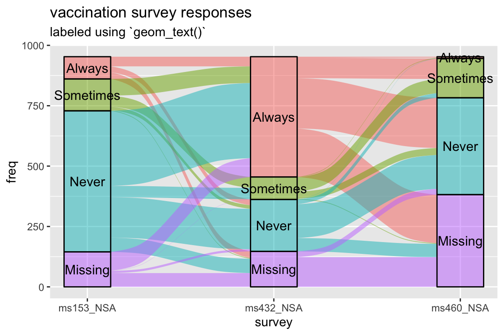
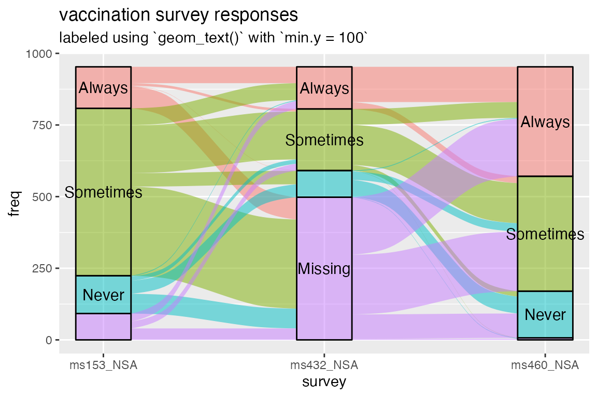
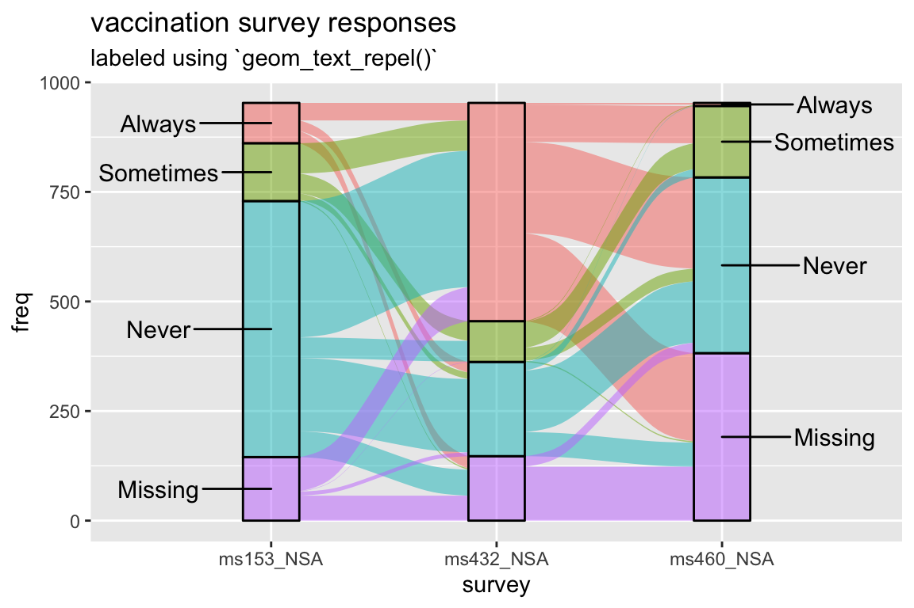
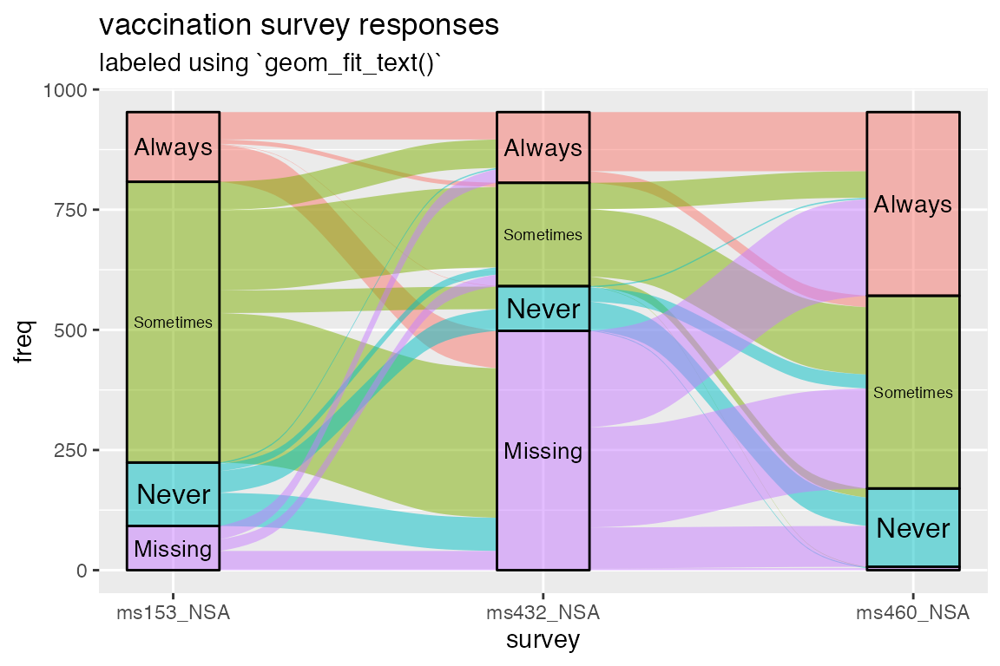

# Labeling small strata

## Setup

This brief vignette uses the `vaccinations` dataset included in
{ggalluvial}. As in [the technical
introduction](http://corybrunson.github.io/ggalluvial/articles/ggalluvial.md),
the order of the levels is reversed to be more intuitive. Objects from
other {ggplot2} extensions are accessed via `::` and `:::`.

``` r
knitr::opts_chunk$set(fig.width = 6, fig.height = 4, fig.align = "center")
library(ggalluvial)
```

    ## Loading required package: ggplot2

``` r
data(vaccinations)
vaccinations <- transform(vaccinations,
                          response = factor(response, rev(levels(response))))
```

## Problem

The issue on the table: Strata are most helpful when they’re overlaid
with text labels. Yet the strata often vary in height, and the labels in
length, to such a degree that fitting the text inside the strata at a
uniform size renders them illegible. In principle, the user could treat
`size` as a variable aesthetic and manually fit text to strata, but this
is cumbersome, and doesn’t help anyway in cases where large text is
needed.

To illustrate the problem, check out the plot below. It’s by no means an
egregious case, but it’ll do. (For a more practical example, see [this
question on
StackOverflow](https://stackoverflow.com/questions/50720718/labelling-and-theme-of-ggalluvial-plot-in-r),
which prompted this vignette.)

``` r
ggplot(vaccinations,
       aes(x = survey, stratum = response, alluvium = subject, y = freq,
           fill = response, label = response)) +
  scale_x_discrete(expand = c(.1, 0)) +
  geom_flow(width = 1/4) +
  geom_stratum(alpha = .5, width = 1/4) +
  geom_text(stat = "stratum", size = 4) +
  theme(legend.position = "none") +
  ggtitle("vaccination survey responses", "labeled using `geom_text()`")
```



### Fix

One option is to simply omit those labels that don’t fit within their
strata. In response to [an
issue](https://github.com/corybrunson/ggalluvial/issues/27), `v0.9.2`
includes parameters in [`stat_stratum()`](../reference/stat_stratum.md)
to exclude strata outside a specified height range; while few would use
this to omit the rectangles themselves, it can be used in tandem with
[`geom_text()`](https://ggplot2.tidyverse.org/reference/geom_text.html)
to shirk this problem, at least when the labels are concise:

``` r
ggplot(vaccinations,
       aes(x = survey, stratum = response, alluvium = subject, y = freq,
           fill = response, label = response)) +
  scale_x_discrete(expand = c(.1, 0)) +
  geom_flow(width = 1/4) +
  geom_stratum(alpha = .5, width = 1/4) +
  geom_text(stat = "stratum", size = 4, min.y = 100) +
  theme(legend.position = "none") +
  ggtitle(
    "vaccination survey responses",
    "labeled using `geom_text()` with `min.y = 100`"
  )
```



This is a useful fix for some cases. Still, if the goal is a
publication-ready graphic, then it reaffirms the need for more adaptable
and elegant solutions. Fortunately, two wonderful packages deliver with,
shall we say, flowing colors.

## Solutions

Two {ggplot2} extensions are well-suited to this problem:
[{ggrepel}](https://github.com/slowkow/ggrepel) and
[{ggfittext}](https://github.com/wilkox/ggfittext). They provide new
geom layers that use the output of existing stat layers to situate text:
[`ggrepel::geom_text_repel()`](https://ggrepel.slowkow.com/reference/geom_text_repel.html)
takes the same aesthetics as
[`ggplot2::geom_text()`](https://ggplot2.tidyverse.org/reference/geom_text.html),
namely `x`, `y`, and `label`. In contrast,
[`ggfittext::geom_fit_text()`](https://wilkox.org/ggfittext/reference/geom_fit_text.html)
only specifically requires `label` but also needs enough information to
determine the rectangle that will contain the text. This can be encoded
as `xmin` and `xmax` or as `x` and `width` for the horizontal direction,
and as `ymin` and `ymax` or as `y` and `height` for the vertical
direction. Conveniently,
[`ggalluvial::stat_stratum()`](../reference/stat_stratum.md) produces
more than enough information for both geoms, including `x`, `xmin`,
`xmax`, and their vertical counterparts.

All this can be gleaned from the `ggproto` objects that construct the
layers:

``` r
print(ggrepel::GeomTextRepel$required_aes)
```

    ## [1] "x"     "y"     "label"

``` r
print(ggfittext:::GeomFitText$required_aes)
```

    ## [1] "label"

``` r
print(ggfittext:::GeomFitText$setup_data)
```

    ## <ggproto method>
    ##   <Wrapper function>
    ##     function (...) 
    ## setup_data(...)
    ## 
    ##   <Inner function (f)>
    ##     function (data, params) 
    ## {
    ##     if (!(!is.null(data$xmin) & !is.null(data$xmax) | !is.null(data$x))) {
    ##         cli::cli_abort("geom_fit_text needs either 'xmin' and 'xmax', or 'x'")
    ##     }
    ##     if (!(!is.null(data$ymin) & !is.null(data$ymax) | !is.null(data$y))) {
    ##         cli::cli_abort("geom_fit_text needs either 'ymin' and 'ymax', or 'y'")
    ##     }
    ##     if ((!is.null(params$width)) & (!inherits(params$width, "unit"))) {
    ##         data$xmin <- data$x - params$width/2
    ##         data$xmax <- data$x + params$width/2
    ##     }
    ##     if ((!is.null(params$height)) & (!inherits(params$height, 
    ##         "unit"))) {
    ##         data$ymin <- data$y - params$height/2
    ##         data$ymax <- data$y + params$height/2
    ##     }
    ##     if (is.null(params$width) & is.null(data$xmin)) {
    ##         data$width <- ggplot2::resolution(data$x, FALSE) * 0.9
    ##         data$xmin <- data$x - data$width/2
    ##         data$xmax <- data$x + data$width/2
    ##         data$width <- NULL
    ##     }
    ##     if (is.null(params$height) & is.null(data$ymin)) {
    ##         data$height <- ggplot2::resolution(data$y, FALSE) * 0.9
    ##         data$ymin <- data$y - data$height/2
    ##         data$ymax <- data$y + data$height/2
    ##         data$height <- NULL
    ##     }
    ##     if (!is.null(params$formatter)) {
    ##         if (!is.function(params$formatter)) {
    ##             cli::cli_abort("`formatter` must be a function")
    ##         }
    ##         formatted_labels <- vapply(data$label, params$formatter, 
    ##             character(1), USE.NAMES = FALSE)
    ##         if ((!length(formatted_labels) == length(data$label)) | 
    ##             (!is.character(formatted_labels))) {
    ##             cli::cli_abort("`formatter` must produce a character vector of same length as input")
    ##         }
    ##         data$label <- formatted_labels
    ##     }
    ##     data$flip <- params$flip
    ##     data
    ## }

``` r
print(StatStratum$compute_panel)
```

    ## <ggproto method>
    ##   <Wrapper function>
    ##     function (...) 
    ## compute_panel(..., self = self)
    ## 
    ##   <Inner function (f)>
    ##     function (self, data, scales, decreasing = NULL, reverse = NULL, 
    ##     absolute = NULL, discern = FALSE, distill = "first", negate.strata = NULL, 
    ##     infer.label = FALSE, label.strata = NULL, min.y = NULL, max.y = NULL, 
    ##     min.height = NULL, max.height = NULL) 
    ## {
    ##     if (is.null(decreasing)) 
    ##         decreasing <- ggalluvial_opt("decreasing")
    ##     if (is.null(reverse)) 
    ##         reverse <- ggalluvial_opt("reverse")
    ##     if (is.null(absolute)) 
    ##         absolute <- ggalluvial_opt("absolute")
    ##     if (!is.null(label.strata)) {
    ##         defunct_parameter("label.strata", msg = "use `aes(label = after_stat(stratum))`.")
    ##         infer.label <- label.strata
    ##     }
    ##     if (infer.label) {
    ##         deprecate_parameter("infer.label", msg = "Use `aes(label = after_stat(stratum))`.")
    ##         if (is.null(data$label)) {
    ##             data$label <- data$stratum
    ##         }
    ##         else {
    ##             warning("Aesthetic `label` is specified, ", "so parameter `infer.label` will be ignored.")
    ##         }
    ##     }
    ##     diff_aes <- intersect(c(.color_diff_aesthetics, .text_aesthetics), 
    ##         names(data))
    ##     data$yneg <- data$y < 0
    ##     data$lode <- data$alluvium
    ##     distill <- distill_fun(distill)
    ##     weight <- data$weight
    ##     data$weight <- NULL
    ##     if (is.null(weight)) 
    ##         weight <- 1
    ##     data$n <- weight
    ##     data$count <- data$y * weight
    ##     by_vars <- c("x", "yneg", "stratum")
    ##     only_vars <- c(diff_aes)
    ##     sum_vars <- c("y", "n", "count")
    ##     if (!is.null(data$lode)) {
    ##         agg_lode <- stats::aggregate(data[, "lode", drop = FALSE], 
    ##             data[, by_vars], distill)
    ##     }
    ##     if (length(only_vars) > 0) {
    ##         agg_only <- stats::aggregate(data[, only_vars, drop = FALSE], 
    ##             data[, by_vars], only)
    ##     }
    ##     data <- stats::aggregate(data[, sum_vars], data[, by_vars], 
    ##         sum)
    ##     if (!is.null(data$lode)) {
    ##         data <- merge(data, agg_lode)
    ##     }
    ##     if (length(only_vars) > 0) {
    ##         data <- merge(data, agg_only)
    ##     }
    ##     data <- subset(data, y != 0)
    ##     data <- deposit_data(data, decreasing, reverse, absolute)
    ##     x_sums <- tapply(abs(data$count), data$x, sum, na.rm = TRUE)
    ##     data$prop <- data$count/x_sums[match(as.character(data$x), 
    ##         names(x_sums))]
    ##     data <- data[with(data, order(deposit)), , drop = FALSE]
    ##     data$ycum <- NA
    ##     for (xx in unique(data$x)) {
    ##         for (yn in c(FALSE, TRUE)) {
    ##             ww <- which(data$x == xx & data$yneg == yn)
    ##             data$ycum[ww] <- cumulate(data$y[ww])
    ##         }
    ##     }
    ##     data$ymin <- data$ycum - abs(data$y)/2
    ##     data$ymax <- data$ycum + abs(data$y)/2
    ##     data$y <- data$ycum
    ##     data$yneg <- NULL
    ##     data$ycum <- NULL
    ##     if (!is.null(min.height)) {
    ##         deprecate_parameter("min.height", "min.y")
    ##         min.y <- min.height
    ##     }
    ##     if (!is.null(max.height)) {
    ##         deprecate_parameter("max.height", "max.y")
    ##         max.y <- max.height
    ##     }
    ##     if (!is.null(min.y)) 
    ##         data <- subset(data, ymax - ymin >= min.y)
    ##     if (!is.null(max.y)) 
    ##         data <- subset(data, ymax - ymin <= max.y)
    ##     data
    ## }

I reached the specific solutions through trial and error. They may not
be the best tricks for most cases, but they demonstrate what these
packages can do. For many more examples, see the respective package
vignettes: [for
{ggrepel}](https://CRAN.R-project.org/package=ggrepel/vignettes/ggrepel.html),
and [for
{ggfittext}](https://CRAN.R-project.org/package=ggfittext/vignettes/introduction-to-ggfittext.html).

### Solution 1: {ggrepel}

{ggrepel} is most often (in my experience) used to repel text away from
symbols in a scatterplot, in whatever directions prevent them from
overlapping the symbols and each other. In this case, however, it makes
much more sense to align them vertically a fixed horizontal distance
(`nudge_x`) away from the strata and repel them vertically from each
other (`direction = "y"`) just enough to print them without overlap. It
takes an extra bit of effort to render text *only* for the strata at the
first (or at the last) axis, but the result is worth it.

``` r
ggplot(vaccinations,
       aes(x = survey, stratum = response, alluvium = subject, y = freq,
           fill = response)) +
  scale_x_discrete(expand = c(.4, 0)) +
  geom_flow(width = 1/4) +
  geom_stratum(alpha = .5, width = 1/4) +
  scale_linetype_manual(values = c("blank", "solid")) +
  ggrepel::geom_text_repel(
    aes(label = ifelse(as.numeric(survey) == 1, as.character(response), NA)),
    stat = "stratum", size = 4, direction = "y", nudge_x = -.5
  ) +
  ggrepel::geom_text_repel(
    aes(label = ifelse(as.numeric(survey) == 3, as.character(response), NA)),
    stat = "stratum", size = 4, direction = "y", nudge_x = .5
  ) +
  theme(legend.position = "none") +
  ggtitle("vaccination survey responses", "labeled using `geom_text_repel()`")
```

    ## Warning: Removed 8 rows containing missing values or values outside the scale range
    ## (`geom_text_repel()`).
    ## Removed 8 rows containing missing values or values outside the scale range
    ## (`geom_text_repel()`).



### Solution 2: {ggfittext}

{ggfittext} is simplicity itself: The strata are just rectangles, so no
more parameter specifications are necessary to fit the text into them.
One key parameter is `min.size`, which defaults to `4` and controls how
small the text is allowed to get without being omitted.

``` r
ggplot(vaccinations,
       aes(x = survey, stratum = response, alluvium = subject, y = freq,
           fill = response, label = response)) +
  scale_x_discrete(expand = c(.1, 0)) +
  geom_flow(width = 1/4) +
  geom_stratum(alpha = .5, width = 1/4) +
  ggfittext::geom_fit_text(stat = "stratum", width = 1/4, min.size = 3) +
  theme(legend.position = "none") +
  ggtitle("vaccination survey responses", "labeled using `geom_fit_text()`")
```



Note that this solution requires {ggfittext} v0.6.0.

## Appendix

``` r
sessioninfo::session_info()
```

    ## ─ Session info ───────────────────────────────────────────────────────────────
    ##  setting  value
    ##  version  R version 4.5.2 (2025-10-31)
    ##  os       macOS Tahoe 26.2
    ##  system   aarch64, darwin20
    ##  ui       X11
    ##  language en
    ##  collate  en_US.UTF-8
    ##  ctype    en_US.UTF-8
    ##  tz       America/New_York
    ##  date     2026-02-22
    ##  pandoc   2.19 @ /opt/homebrew/bin/ (via rmarkdown)
    ##  quarto   1.8.25 @ /usr/local/bin/quarto
    ## 
    ## ─ Packages ───────────────────────────────────────────────────────────────────
    ##  package      * version date (UTC) lib source
    ##  bslib          0.9.0   2025-01-30 [2] CRAN (R 4.5.0)
    ##  cachem         1.1.0   2024-05-16 [2] CRAN (R 4.5.0)
    ##  cli            3.6.5   2025-04-23 [2] CRAN (R 4.5.0)
    ##  desc           1.4.3   2023-12-10 [2] CRAN (R 4.5.0)
    ##  digest         0.6.39  2025-11-19 [2] CRAN (R 4.5.2)
    ##  dplyr          1.1.4   2023-11-17 [2] CRAN (R 4.5.0)
    ##  evaluate       1.0.5   2025-08-27 [2] CRAN (R 4.5.0)
    ##  farver         2.1.2   2024-05-13 [2] CRAN (R 4.5.0)
    ##  fastmap        1.2.0   2024-05-15 [2] CRAN (R 4.5.0)
    ##  fs             1.6.6   2025-04-12 [2] CRAN (R 4.5.0)
    ##  generics       0.1.4   2025-05-09 [2] CRAN (R 4.5.0)
    ##  ggalluvial   * 0.12.6  2026-02-22 [1] local
    ##  ggfittext      0.10.3  2025-12-13 [2] CRAN (R 4.5.2)
    ##  ggplot2      * 4.0.2   2026-02-03 [2] CRAN (R 4.5.2)
    ##  ggrepel        0.9.6   2024-09-07 [2] CRAN (R 4.5.0)
    ##  glue           1.8.0   2024-09-30 [2] CRAN (R 4.5.0)
    ##  gtable         0.3.6   2024-10-25 [2] CRAN (R 4.5.0)
    ##  htmltools      0.5.9   2025-12-04 [2] CRAN (R 4.5.2)
    ##  htmlwidgets    1.6.4   2023-12-06 [2] CRAN (R 4.5.0)
    ##  jquerylib      0.1.4   2021-04-26 [2] CRAN (R 4.5.0)
    ##  jsonlite       2.0.0   2025-03-27 [2] CRAN (R 4.5.0)
    ##  knitr          1.51    2025-12-20 [2] CRAN (R 4.5.2)
    ##  labeling       0.4.3   2023-08-29 [2] CRAN (R 4.5.0)
    ##  lifecycle      1.0.5   2026-01-08 [2] CRAN (R 4.5.2)
    ##  magrittr       2.0.4   2025-09-12 [2] CRAN (R 4.5.0)
    ##  otel           0.2.0   2025-08-29 [2] CRAN (R 4.5.0)
    ##  pillar         1.11.1  2025-09-17 [2] CRAN (R 4.5.0)
    ##  pkgconfig      2.0.3   2019-09-22 [2] CRAN (R 4.5.0)
    ##  pkgdown        2.2.0   2025-11-06 [2] CRAN (R 4.5.0)
    ##  purrr          1.2.1   2026-01-09 [2] CRAN (R 4.5.2)
    ##  R6             2.6.1   2025-02-15 [2] CRAN (R 4.5.0)
    ##  ragg           1.5.0   2025-09-02 [2] CRAN (R 4.5.0)
    ##  RColorBrewer   1.1-3   2022-04-03 [2] CRAN (R 4.5.0)
    ##  Rcpp           1.1.1   2026-01-10 [2] CRAN (R 4.5.2)
    ##  rlang          1.1.7   2026-01-09 [2] CRAN (R 4.5.2)
    ##  rmarkdown      2.30    2025-09-28 [2] CRAN (R 4.5.0)
    ##  S7             0.2.1   2025-11-14 [2] CRAN (R 4.5.2)
    ##  sass           0.4.10  2025-04-11 [2] CRAN (R 4.5.0)
    ##  scales         1.4.0   2025-04-24 [2] CRAN (R 4.5.0)
    ##  sessioninfo    1.2.3   2025-02-05 [2] CRAN (R 4.5.0)
    ##  stringi        1.8.7   2025-03-27 [2] CRAN (R 4.5.0)
    ##  systemfonts    1.3.1   2025-10-01 [2] CRAN (R 4.5.0)
    ##  textshaping    1.0.4   2025-10-10 [2] CRAN (R 4.5.0)
    ##  tibble         3.3.1   2026-01-11 [2] CRAN (R 4.5.2)
    ##  tidyr          1.3.2   2025-12-19 [2] CRAN (R 4.5.2)
    ##  tidyselect     1.2.1   2024-03-11 [2] CRAN (R 4.5.0)
    ##  vctrs          0.7.1   2026-01-23 [2] CRAN (R 4.5.2)
    ##  withr          3.0.2   2024-10-28 [2] CRAN (R 4.5.0)
    ##  xfun           0.56    2026-01-18 [2] CRAN (R 4.5.2)
    ##  yaml           2.3.12  2025-12-10 [2] CRAN (R 4.5.2)
    ## 
    ##  [1] /private/var/folders/4p/3cy0qmp15x9216qsqhh84kzm0000gn/T/RtmpXbhyna/temp_libpath5542f864f19
    ##  [2] /Library/Frameworks/R.framework/Versions/4.5-arm64/Resources/library
    ##  * ── Packages attached to the search path.
    ## 
    ## ──────────────────────────────────────────────────────────────────────────────
