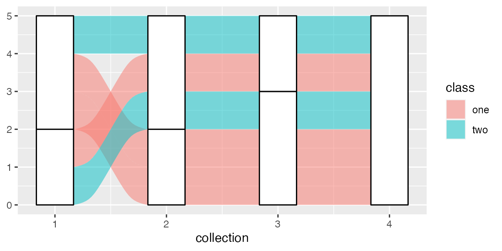

# The Order of the Rectangles

How the strata and lodes at each axis are ordered, and how to control
their order, is a complicated but essential part of {ggalluvial}’s
functionality. This vignette explains the motivations behind the
implementation and explores the functionality in greater detail than the
examples.

## Setup

``` r
knitr::opts_chunk$set(fig.width = 6, fig.height = 3, fig.align = "center")
library(ggalluvial)
```

    ## Loading required package: ggplot2

All of the functionality discussed in this vignette is exported by
{ggalluvial}. We’ll also need a toy data set to play with. I conjured
the data frame `toy` to be nearly as small as possible while complex
enough to illustrate the positional controls:

``` r
# toy data set
set.seed(0)
toy <- data.frame(
  subject = rep(LETTERS[1:5], times = 4),
  collection = rep(1:4, each  = 5),
  category = rep(
    sample(c("X", "Y"), 16, replace = TRUE),
    rep(c(1, 2, 1, 1), times = 4)
  ),
  class = c("one", "one", "one", "two", "two")
)
print(toy)
```

    ##    subject collection category class
    ## 1        A          1        Y   one
    ## 2        B          1        X   one
    ## 3        C          1        X   one
    ## 4        D          1        Y   two
    ## 5        E          1        X   two
    ## 6        A          2        X   one
    ## 7        B          2        Y   one
    ## 8        C          2        Y   one
    ## 9        D          2        X   two
    ## 10       E          2        X   two
    ## 11       A          3        X   one
    ## 12       B          3        Y   one
    ## 13       C          3        Y   one
    ## 14       D          3        Y   two
    ## 15       E          3        X   two
    ## 16       A          4        X   one
    ## 17       B          4        X   one
    ## 18       C          4        X   one
    ## 19       D          4        X   two
    ## 20       E          4        X   two

The subjects are classified into categories at each collection point but
are also members of fixed classes. Here’s how {ggalluvial} visualizes
these data under default settings:

``` r
ggplot(toy, aes(x = collection, stratum = category, alluvium = subject)) +
  geom_alluvium(aes(fill = class)) +
  geom_stratum()
```



## Motivations

The amount of control the stat layers `stat_alluvial()` and
[`stat_flow()`](../reference/stat_flow.md) exert over the [positional
aesthetics](https://ggplot2.tidyverse.org/reference/aes_position.html)
of graphical objects (grobs) is unusual, by the standards of {ggplot2}
and many of its extensions. In [the layered grammar of graphics
framework](https://www.tandfonline.com/doi/abs/10.1198/jcgs.2009.07098),
the role of a statistical transformation is usually to summarize the
original data, for example by binning
([`stat_bin()`](https://ggplot2.tidyverse.org/reference/geom_histogram.html))
or by calculating quantiles
([`stat_qq()`](https://ggplot2.tidyverse.org/reference/geom_qq.html)).
These transformed data are then sent to geom layers for positioning. The
positions of grobs may be adjusted after the statistical transformation,
for example when points are jittered
([`geom_jitter()`](https://ggplot2.tidyverse.org/reference/geom_jitter.html)),
but the numerical data communicated by the plot are still the product of
the stat.

In {ggalluvial}, the stat layers exert slightly more control. For one
thing, the transformation is more sophisticated than a single value or a
fixed-length vector, such as a mean, standard deviation, or five-number
summary. Instead, the values of `y` (which default to `1`) within each
collection are, after reordering, transformed using
[`cumsum()`](https://rdrr.io/r/base/cumsum.html) and some additional
arithmetic to obtain coordinates for the centers `y` and lower and upper
limits `ymin` and `ymax` of the strata representing the categories.
Additionally, the reordering of lodes within each collection relies on a
hierarchy of sorting variables, based on the strata at nearby axes as
well as the present one and, optionally, on the values of
differentiation aesthetics like `fill`. How this hierarchy is invoked
depends on the choices of several plotting parameters (`decreasing`,
`reverse`, and `absolute`). Thus, the results of the statistical
transformations are not as intrinsically meaningful as others and are
subject to much more intervention by the user. Only once the
transformations have produced these coordinates do the geom layers use
them to position the rectangles and splines that constitute the plot.

There are two key reasons for this division of labor:

1.  The coordinates returned by some stat layers can be coupled with
    multiple geom layers. For example, all four geoms can couple with
    the `alluvium` stat. Moreover, as showcased in [the
    examples](http://corybrunson.github.io/ggalluvial/reference/index.md),
    the stats can also meaningfully couple with exogenous geoms like
    `text`, `pointrange`, and `errorbar`. (In principle, the geoms could
    also couple with exogenous stats, but i haven’t done this or seen it
    done in the wild.)
2.  Different parameters control the calculations of the coordinates
    (e.g. `aes.bind` and `cement.alluvia`) and the rendering of the
    graphical elements (`width`, `knot.pos`, and `aes.flow`), and it
    makes intuitive sense to handle these separately. For example, the
    heights of the strata and lodes convey information about the
    underlying data, whereas their widths are arbitrary.

(If the data are provided in alluvia format, then `Stat*$setup_data()`
converts them to lodes format in preparation for the main
transformation. This can be done manually using [the exported conversion
functions](http://corybrunson.github.io/ggalluvial/reference/alluvial-data.md),
and this vignette will assume the data are already in lodes format.)

## Positioning strata

Each stat layer demarcates one stack for each data collection point and
one rectangle within each stack for each (non-empty) category.[¹](#fn1)
In [{ggalluvial}
terms](http://corybrunson.github.io/ggalluvial/articles/ggalluvial.md),
the collection points are axes and the rectangles are strata or lodes.

To generate a sequence of stacked bar plots with no connecting flows,
only the aesthetics `x` (standard) and `stratum` (custom) are required:

``` r
# collection point and category variables only
data <- structure(toy[, 2:3], names = c("x", "stratum"))
# required fields for stat transformations
data$y <- 1
data$PANEL <- 1
# stratum transformation
StatStratum$compute_panel(data)
```

    ##   x stratum   y n count deposit prop ymin ymax
    ## 2 1       Y 1.0 2     2       1  0.4    0    2
    ## 1 1       X 3.5 3     3       2  0.6    2    5
    ## 4 2       Y 1.0 2     2       3  0.4    0    2
    ## 3 2       X 3.5 3     3       4  0.6    2    5
    ## 6 3       Y 1.5 3     3       5  0.6    0    3
    ## 5 3       X 4.0 2     2       6  0.4    3    5
    ## 7 4       X 2.5 5     5       7  1.0    0    5

Comparing this output to `toy`, notice first that the data have been
aggregated: Each distinct combination of `x` and `stratum` occupies only
one row. `x` encodes the axes and is subject to layers specific to this
positional aesthetic, e.g. `scale_x_*()` transformations. `ymin` and
`ymax` are the lower and upper bounds of the rectangles, and `y` is
their vertical centers. Each stacked rectangle begins where the one
below it ends, and their heights are the numbers of subjects (or the
totals of their `y` values, if `y` is passed a numerical variable) that
take the corresponding category value at the corresponding collection
point.

Here’s the plot this strata-only transformation yields:

``` r
ggplot(toy, aes(x = collection, stratum = category)) +
  stat_stratum() +
  stat_stratum(geom = "text", aes(label = category))
```


In this vignette, i’ll use the `stat_*()` functions to add layers, so
that the parameters that control their behavior are accessible via
tab-completion.

### Reversing the strata

Within each axis, `stratum` defaults to reverse order so that the bars
proceed in the original order from top to bottom. This can be overridden
by setting `reverse = FALSE` in
[`stat_stratum()`](../reference/stat_stratum.md):

``` r
# stratum transformation with strata in original order
StatStratum$compute_panel(data, reverse = FALSE)
```

    ##   x stratum   y n count deposit prop ymin ymax
    ## 1 1       X 1.5 3     3       1  0.6    0    3
    ## 2 1       Y 4.0 2     2       2  0.4    3    5
    ## 3 2       X 1.5 3     3       3  0.6    0    3
    ## 4 2       Y 4.0 2     2       4  0.4    3    5
    ## 5 3       X 1.0 2     2       5  0.4    0    2
    ## 6 3       Y 3.5 3     3       6  0.6    2    5
    ## 7 4       X 2.5 5     5       7  1.0    0    5

``` r
ggplot(toy, aes(x = collection, stratum = category)) +
  stat_stratum(reverse = FALSE) +
  stat_stratum(geom = "text", aes(label = category), reverse = FALSE)
```


**Warning:** The caveat to this is that, *if `reverse` is declared in
any layer, then it must be declared in every layer*, lest the layers be
misaligned. This includes any `alluvium`, `flow`, and `lode` layers,
since their graphical elements are organized within the bounds of the
strata.

### Sorting the strata by size

When the strata are defined by a character or factor variable, they
default to the order of the variable (lexicographic in the former case).
This can be overridden by the `decreasing` parameter, which defaults to
`NA` but can be set to `TRUE` or `FALSE` to arrange the strata in
decreasing or increasing order in the `y` direction:

``` r
# stratum transformation with strata in original order
StatStratum$compute_panel(data, reverse = FALSE)
```

    ##   x stratum   y n count deposit prop ymin ymax
    ## 1 1       X 1.5 3     3       1  0.6    0    3
    ## 2 1       Y 4.0 2     2       2  0.4    3    5
    ## 3 2       X 1.5 3     3       3  0.6    0    3
    ## 4 2       Y 4.0 2     2       4  0.4    3    5
    ## 5 3       X 1.0 2     2       5  0.4    0    2
    ## 6 3       Y 3.5 3     3       6  0.6    2    5
    ## 7 4       X 2.5 5     5       7  1.0    0    5

``` r
ggplot(toy, aes(x = collection, stratum = category)) +
  stat_stratum(decreasing = TRUE) +
  stat_stratum(geom = "text", aes(label = category), decreasing = TRUE)
```


**Warning:** The same caveat applies to `decreasing` as to `reverse`:
Make sure that all layers using alluvial stats are passed the same
values! Henceforth, we’ll use the default (reverse and categorical)
ordering of the strata themselves.

## Positioning lodes within strata

### Alluvia and flows

In the strata-only plot, each subject is represented once at each axis.
*Alluvia* are x-splines that connect these multiple representations of
the same subjects across the axes. In order to avoid having these
splines overlap at the axes, the `alluvium` stat must stack the alluvial
cohorts—subsets of subjects who have a common profile across all
axes—within each stratum. These smaller cohort-specific rectangles are
the *lodes*. This calculation requires the additional custom `alluvium`
aesthetic, which identifies common subjects across the axes:

``` r
# collection point, category, and subject variables
data <- structure(toy[, 1:3], names = c("alluvium", "x", "stratum"))
# required fields for stat transformations
data$y <- 1
data$PANEL <- 1
# alluvium transformation
StatAlluvium$compute_panel(data)
```

    ##    x alluvium stratum   y PANEL lode n count deposit prop ymin ymax group
    ## 1  1        A       Y 1.5     1    A 1     1       1  0.2    1    2     1
    ## 2  1        B       X 3.5     1    B 1     1       2  0.2    3    4     2
    ## 3  1        C       X 2.5     1    C 1     1       2  0.2    2    3     3
    ## 4  1        D       Y 0.5     1    D 1     1       1  0.2    0    1     4
    ## 5  1        E       X 4.5     1    E 1     1       2  0.2    4    5     5
    ## 6  2        A       X 3.5     1    A 1     1       4  0.2    3    4     1
    ## 7  2        B       Y 1.5     1    B 1     1       3  0.2    1    2     2
    ## 8  2        C       Y 0.5     1    C 1     1       3  0.2    0    1     3
    ## 9  2        D       X 2.5     1    D 1     1       4  0.2    2    3     4
    ## 10 2        E       X 4.5     1    E 1     1       4  0.2    4    5     5
    ## 11 3        A       X 3.5     1    A 1     1       6  0.2    3    4     1
    ## 12 3        B       Y 1.5     1    B 1     1       5  0.2    1    2     2
    ## 13 3        C       Y 0.5     1    C 1     1       5  0.2    0    1     3
    ## 14 3        D       Y 2.5     1    D 1     1       5  0.2    2    3     4
    ## 15 3        E       X 4.5     1    E 1     1       6  0.2    4    5     5
    ## 16 4        A       X 3.5     1    A 1     1       7  0.2    3    4     1
    ## 17 4        B       X 1.5     1    B 1     1       7  0.2    1    2     2
    ## 18 4        C       X 0.5     1    C 1     1       7  0.2    0    1     3
    ## 19 4        D       X 2.5     1    D 1     1       7  0.2    2    3     4
    ## 20 4        E       X 4.5     1    E 1     1       7  0.2    4    5     5

The transformed data now contain *one row per cohort*—instead of per
category—*per collection point*. The vertical positional aesthetics
describe the lodes rather than the strata, and the `group` variable
encodes the `alluvia` (a convenience for the geom layer, and the reason
that {ggalluvial} stat layers ignore variables passed to `group`).

Here’s how this transformation translates into the alluvial plot that
began the vignette, labeling the subject of each alluvium at each
intersection with a stratum:

``` r
ggplot(toy, aes(x = collection, stratum = category, alluvium = subject)) +
  stat_alluvium(aes(fill = class)) +
  stat_stratum(alpha = .25) +
  stat_alluvium(geom = "text", aes(label = subject))
```


The `flow` stat differs from the `alluvium` stat by allowing the orders
of the lodes within strata to differ from one side of an axis to the
other. Put differently, the `flow` stat allows *mixing* at the axes,
rather than requiring that each case or cohort is follows a continuous
trajectory from one end of the plot to the other. As a result, flow
plots are often much less cluttered, the trade-off being that cases or
cohorts cannot be tracked through them.

``` r
# flow transformation
StatFlow$compute_panel(data)
```

    ##    alluvium x stratum deposit flow   y n count lode group prop ymin ymax
    ## 3         2 1       Y       1 from 1.0 2     2    A     2  0.4    0    2
    ## 1         1 1       X       2 from 3.0 2     2    B     1  0.4    2    4
    ## 5         3 1       X       2 from 4.5 1     1    E     3  0.2    4    5
    ## 2         1 2       Y       3   to 1.0 2     2    B     1  0.2    0    2
    ## 4         2 2       X       4   to 3.0 2     2    A     2  0.2    2    4
    ## 6         3 2       X       4   to 4.5 1     1    E     3  0.1    4    5
    ## 7         4 2       Y       3 from 1.0 2     2    B     4  0.2    0    2
    ## 9         5 2       X       4 from 2.5 1     1    D     5  0.1    2    3
    ## 11        6 2       X       4 from 4.0 2     2    A     6  0.2    3    5
    ## 8         4 3       Y       5   to 1.0 2     2    B     4  0.2    0    2
    ## 10        5 3       Y       5   to 2.5 1     1    D     5  0.1    2    3
    ## 12        6 3       X       6   to 4.0 2     2    A     6  0.2    3    5
    ## 13        7 3       Y       5 from 1.5 3     3    B     7  0.3    0    3
    ## 15        8 3       X       6 from 4.0 2     2    A     8  0.2    3    5
    ## 14        7 4       X       7   to 1.5 3     3    B     7  0.6    0    3
    ## 16        8 4       X       7   to 4.0 2     2    A     8  0.4    3    5

The `flow` stat transformation yields *one row per cohort per side per
flow*. Each intermediate axis appears twice in the data, once for the
incoming flow and once for the outgoing flow. (The starting and ending
axes only have rows for outgoing and incoming flows, respectively.) Here
is the flow version of the preceding alluvial plot, labeling each side
of each flow with the corresponding subject:

``` r
ggplot(toy, aes(x = collection, stratum = category, alluvium = subject)) +
  stat_stratum() +
  stat_flow(aes(fill = class)) +
  stat_flow(geom = "text",
            aes(label = subject, hjust = after_stat(flow) == "to"))
```


The [computed
variable](https://ggplot2.tidyverse.org/reference/aes_eval.html) `flow`
indicates whether each row of the `compute_panel()` output corresponds
to a flow *to* or *from* its axis; the values are used to nudge the
labels toward their respective flows (to avoid overlap). Mismatches
between adjacent labels indicate where lodes are ordered differently on
either side of a stratum.

### Lode guidance

As the number of strata at each axis grows, heterogeneous cases or
cohorts can produce highly complex alluvia and very messy plots.
{ggalluvial} mitigates this by strategically arranging the lodes—the
intersections of the alluvia with the strata—so as to reduce their
crossings between adjacent axes. This strategy is executed locally: At
each axis (call it the *index* axis), the order of the lodes is guided
by several totally or partially ordered variables. In order of priority:

1.  the strata at the index axis
2.  the strata at the other axes to which the index axis is linked by
    alluvia or flows—namely, all other axes in the case of an alluvium,
    or a single adjacent axis in the case of a flow
3.  the alluvia themselves, i.e. the variable passed to `alluvium`

In the alluvium case, the prioritization of the remaining axes is
determined by a *lode guidance function*. A lode guidance function can
be passed to the `lode.guidance` parameter, which defaults to
`"zigzag"`. This function puts the nearest (adjacent) axes first, then
zigzags outward from there, initially (the “zig”) in the direction of
the closer extreme:

``` r
for (i in 1:4) print(lode_zigzag(4, i))
```

    ## [1] 1 2 3 4
    ## [1] 2 1 3 4
    ## [1] 3 4 2 1
    ## [1] 4 3 2 1

Several alternative `lode_*()` functions are available:

- `"zagzig"` behaves like `"zigzag"` except initially “zags” toward the
  farther extreme.
- `"frontback"` and `"backfront"` behave like `"zigzag"` but extend
  completely in one outward direction from the index axis before the
  other.
- `"forward"` and `"backward"` put the remaining axes in increasing and
  decreasing order, regardless of the relative position of the index
  axis.

Two alternatives are illustrated below:

``` r
for (i in 1:4) print(lode_backfront(4, i))
```

    ## [1] 1 2 3 4
    ## [1] 2 1 3 4
    ## [1] 3 2 1 4
    ## [1] 4 3 2 1

``` r
ggplot(toy, aes(x = collection, stratum = category, alluvium = subject)) +
  stat_alluvium(aes(fill = class), lode.guidance = "backfront") +
  stat_stratum() +
  stat_alluvium(geom = "text", aes(label = subject),
                lode.guidance = "backfront")
```


The difference between `"backfront"` guidance and `"zigzag"` guidance
can be seen in the order of the lodes of the `"Y"` stratum at axis `3`:
Whereas `"zigzag"` minimized the crossings between axes `3` and `4`,
locating the distinctive class-`"one"` case above the others,
`"backfront"` minimized the crossings between axes `2` and `3` (axis `2`
being immediately before axis `3`), locating this case below the others.

``` r
for (i in 1:4) print(lode_backward(4, i))
```

    ## [1] 1 4 3 2
    ## [1] 2 4 3 1
    ## [1] 3 4 2 1
    ## [1] 4 3 2 1

``` r
ggplot(toy, aes(x = collection, stratum = category, alluvium = subject)) +
  stat_alluvium(aes(fill = class), lode.guidance = "backward") +
  stat_stratum() +
  stat_alluvium(geom = "text", aes(label = subject),
                lode.guidance = "backward")
```


The effect of `"backward"` guidance is to keep the right part of the
plot as tidy as possible while allowing the left part to become as messy
as necessary. (`"forward"` has the opposite effect.)

### Aesthetic binding

It often makes sense to bundle together the cases and cohorts that fall
into common groups used to assign differentiation aesthetics: most
commonly `fill`, but also `alpha`, which controls the opacity of the
`fill` colors, and `colour`, `linetype`, and `size`, which control the
borders of the alluvia, flows, and lodes.

The `aes.bind` parameter defaults to `"none"`, in which case aesthetics
play no role in the order of the lodes. Setting the parameter to
`"flows"` prioritizes any such aesthetics *after* the strata of any
other axes but *before* the alluvia of the index axis (effectively
ordering the flows at each axis by aesthetic), while setting it to
`"alluvia"` prioritizes aesthetics *before* the strata of any other axes
(effectively ordering the alluvia). In the toy example, the stronger
option results in the lodes within each stratum being sorted first by
class:

``` r
ggplot(toy, aes(x = collection, stratum = category, alluvium = subject)) +
  stat_alluvium(aes(fill = class, label = subject), aes.bind = "alluvia") +
  stat_stratum() +
  stat_alluvium(geom = "text", aes(fill = class, label = subject),
                aes.bind = "alluvia")
```

    ## Warning in stat_alluvium(aes(fill = class, label = subject), aes.bind =
    ## "alluvia"): Ignoring unknown aesthetics: label

    ## Warning in stat_alluvium(geom = "text", aes(fill = class, label = subject), :
    ## Ignoring unknown aesthetics: fill


The more flexible option groups the lodes by class only after they’ve
been ordered according to the strata at the remaining axes:

``` r
ggplot(toy, aes(x = collection, stratum = category, alluvium = subject)) +
  stat_alluvium(aes(fill = class, label = subject), aes.bind = "flows") +
  stat_stratum() +
  stat_alluvium(geom = "text", aes(fill = class, label = subject),
                aes.bind = "flows")
```

    ## Warning in stat_alluvium(aes(fill = class, label = subject), aes.bind =
    ## "flows"): Ignoring unknown aesthetics: label

    ## Warning in stat_alluvium(geom = "text", aes(fill = class, label = subject), :
    ## Ignoring unknown aesthetics: fill


**Warning:** In addition to parameters like `reverse`, *when aesthetic
variables are prioritized at all, overlaid alluvial layers must include
the same aesthetics in the same order*. (This can produce warnings when
the aesthetics are not recognized by the geom.) Try removing
`fill = class` from the text geom above to see the risk posed by
neglecting this check.

Rather than ordering lodes *within*, the `flow` stat separately orders
the flows *into* and *out from*, each stratum. (This precludes a
corresponding `"alluvia"` option for `aes.bind`.) By default, the flows
are ordered with respect first to the orders of the strata at the
present axis and second to those at the adjacent axis. Setting
`aes.bind` to the non-default option `"flows"` tells
[`stat_flow()`](../reference/stat_flow.md) to prioritize flow aesthetics
after the strata of the index axis but before the strata of the adjacent
axis:

``` r
ggplot(toy, aes(x = collection, stratum = category, alluvium = subject)) +
  stat_flow(aes(fill = class, label = subject), aes.bind = "flows") +
  stat_stratum() +
  stat_flow(geom = "text",
            aes(fill = class, label = subject,
                hjust = after_stat(flow) == "to"),
            aes.bind = "flows")
```

    ## Warning in stat_flow(aes(fill = class, label = subject), aes.bind = "flows"):
    ## Ignoring unknown aesthetics: label

    ## Warning in stat_flow(geom = "text", aes(fill = class, label = subject, hjust =
    ## after_stat(flow) == : Ignoring unknown aesthetics: fill


Note: The `aes.flow` parameter tells
[`geom_flow()`](../reference/geom_flow.md) how flows should inherit
differentiation aesthetics from adjacent axes—`"forward"` or
`"backward"`. It does *not* influence their positions.

### Manual lode ordering

Finally, one may wish to put the lodes at each axis in a predefined
order, subject to their being located in the correct strata. This can be
done by passing a data column to the `order` aesthetic. For the toy
example, we can pass a vector that puts the cases in the order of their
IDs in the data at every axis:

``` r
lode_ord <- rep(seq(5), times = 4)
ggplot(toy, aes(x = collection, stratum = category, alluvium = subject)) +
  stat_alluvium(aes(fill = class, order = lode_ord)) +
  stat_stratum() +
  stat_alluvium(geom = "text",
                aes(fill = class, order = lode_ord, label = subject))
```

    ## Warning in stat_alluvium(aes(fill = class, order = lode_ord)): Ignoring
    ## unknown aesthetics: order

    ## Warning in stat_alluvium(geom = "text", aes(fill = class, order = lode_ord, :
    ## Ignoring unknown aesthetics: fill and order


``` r
ggplot(toy, aes(x = collection, stratum = category, alluvium = subject)) +
  stat_flow(aes(fill = class, order = lode_ord)) +
  stat_stratum() +
  stat_flow(geom = "text",
            aes(fill = class, order = lode_ord, label = subject,
                hjust = after_stat(flow) == "to"))
```

    ## Warning in stat_flow(geom = "text", aes(fill = class, order = lode_ord, :
    ## Ignoring unknown aesthetics: fill


Within each stratum at each axis, the cases are now in order from top to
bottom.

## Negative strata

In response to an elegant real-world use case, {ggalluvial} can now
handle negative observations in the same way as
[`geom_bar()`](https://ggplot2.tidyverse.org/reference/geom_bar.html):
by grouping these observations into negative strata and stacking these
strata in the negative `y` direction (i.e. in the opposite direction of
the positive strata). This new functionality complicates the above
discussion in two ways:

1.  *Positioning strata:* The negative strata could be reverse-ordered
    with respect to the positive strata, as in
    [`geom_bar()`](https://ggplot2.tidyverse.org/reference/geom_bar.html),
    or ordered in the same way (vertically, without regard for sign).
2.  *Positioning lodes within strata:* Two strata may correspond to the
    same stratum variable at an axis (one positive and one negative),
    which under-determines the ordering of lodes within strata.

The first issue is binary: Once `decreasing` and `reverse` are chosen,
there are only two options for the negative strata. The choice is made
by setting the new `absolute` parameter to either `TRUE` (the default),
which yields a mirror-image ordering, or `FALSE`, which adopts the same
vertical ordering. This setting also influences the ordering of lodes
within strata at the same nexus as `reverse`, namely at the level of the
alluvium variable. The second issue is then handled by creating a
`deposit` variable with unique values corresponding to each *signed*
stratum variable value, in the order prescribed by `decreasing`,
`reverse`, and `absolute`. The `deposit` variable is then used in place
of `stratum` for all of the lode-ordering tasks above.

As a point of reference, here is a bar plot of the toy data, with a
randomized sign variable used to indicate negative-valued observations:

``` r
set.seed(78)
toy$sign <- sample(c(-1, 1), nrow(toy), replace = TRUE)
print(toy)
```

    ##    subject collection category class sign
    ## 1        A          1        Y   one   -1
    ## 2        B          1        X   one    1
    ## 3        C          1        X   one    1
    ## 4        D          1        Y   two   -1
    ## 5        E          1        X   two    1
    ## 6        A          2        X   one    1
    ## 7        B          2        Y   one    1
    ## 8        C          2        Y   one    1
    ## 9        D          2        X   two   -1
    ## 10       E          2        X   two   -1
    ## 11       A          3        X   one    1
    ## 12       B          3        Y   one   -1
    ## 13       C          3        Y   one   -1
    ## 14       D          3        Y   two    1
    ## 15       E          3        X   two    1
    ## 16       A          4        X   one    1
    ## 17       B          4        X   one    1
    ## 18       C          4        X   one   -1
    ## 19       D          4        X   two   -1
    ## 20       E          4        X   two    1

``` r
ggplot(toy, aes(x = collection, y = sign)) +
  geom_bar(aes(fill = class), stat = "identity")
```


The default behavior, illustrated here with flows, is for the positive
strata to proceed downward and the negative strata to proceed upward, in
both cases from larger absolute values to zero:

``` r
ggplot(toy, aes(x = collection, stratum = category, alluvium = subject,
                y = sign)) +
  geom_flow(aes(fill = class)) +
  geom_stratum() +
  geom_text(stat = "stratum", aes(label = category))
```


To instead have the strata proceed downward at each axis, and the lodes
downward within each stratum, set `absolute = FALSE` (now plotting
alluvia):

``` r
ggplot(toy, aes(x = collection, stratum = category, alluvium = subject,
                y = sign)) +
  geom_alluvium(aes(fill = class), absolute = FALSE) +
  geom_stratum(absolute = FALSE) +
  geom_text(stat = "alluvium", aes(label = subject), absolute = FALSE)
```


Note again that the labels are consistent with the alluvia and flows,
despite the omission of the `fill` aesthetic from the text geom, because
the aesthetic variables are not prioritized in the ordering of the
lodes.

## More examples

More examples of all of the functionality showcased here can be found in
the documentation for the `stat_*()` functions, [browsable on the
package
website](http://corybrunson.github.io/ggalluvial/reference/index.md).

## Appendix

``` r
sessioninfo::session_info()
```

    ## ─ Session info ───────────────────────────────────────────────────────────────
    ##  setting  value
    ##  version  R version 4.5.2 (2025-10-31)
    ##  os       macOS Tahoe 26.2
    ##  system   aarch64, darwin20
    ##  ui       X11
    ##  language en
    ##  collate  en_US.UTF-8
    ##  ctype    en_US.UTF-8
    ##  tz       America/New_York
    ##  date     2026-02-22
    ##  pandoc   2.19 @ /opt/homebrew/bin/ (via rmarkdown)
    ##  quarto   1.8.25 @ /usr/local/bin/quarto
    ## 
    ## ─ Packages ───────────────────────────────────────────────────────────────────
    ##  package      * version date (UTC) lib source
    ##  bslib          0.9.0   2025-01-30 [2] CRAN (R 4.5.0)
    ##  cachem         1.1.0   2024-05-16 [2] CRAN (R 4.5.0)
    ##  cli            3.6.5   2025-04-23 [2] CRAN (R 4.5.0)
    ##  desc           1.4.3   2023-12-10 [2] CRAN (R 4.5.0)
    ##  digest         0.6.39  2025-11-19 [2] CRAN (R 4.5.2)
    ##  dplyr          1.1.4   2023-11-17 [2] CRAN (R 4.5.0)
    ##  evaluate       1.0.5   2025-08-27 [2] CRAN (R 4.5.0)
    ##  farver         2.1.2   2024-05-13 [2] CRAN (R 4.5.0)
    ##  fastmap        1.2.0   2024-05-15 [2] CRAN (R 4.5.0)
    ##  fs             1.6.6   2025-04-12 [2] CRAN (R 4.5.0)
    ##  generics       0.1.4   2025-05-09 [2] CRAN (R 4.5.0)
    ##  ggalluvial   * 0.12.6  2026-02-22 [1] local
    ##  ggplot2      * 4.0.2   2026-02-03 [2] CRAN (R 4.5.2)
    ##  glue           1.8.0   2024-09-30 [2] CRAN (R 4.5.0)
    ##  gtable         0.3.6   2024-10-25 [2] CRAN (R 4.5.0)
    ##  htmltools      0.5.9   2025-12-04 [2] CRAN (R 4.5.2)
    ##  htmlwidgets    1.6.4   2023-12-06 [2] CRAN (R 4.5.0)
    ##  jquerylib      0.1.4   2021-04-26 [2] CRAN (R 4.5.0)
    ##  jsonlite       2.0.0   2025-03-27 [2] CRAN (R 4.5.0)
    ##  knitr          1.51    2025-12-20 [2] CRAN (R 4.5.2)
    ##  labeling       0.4.3   2023-08-29 [2] CRAN (R 4.5.0)
    ##  lifecycle      1.0.5   2026-01-08 [2] CRAN (R 4.5.2)
    ##  magrittr       2.0.4   2025-09-12 [2] CRAN (R 4.5.0)
    ##  otel           0.2.0   2025-08-29 [2] CRAN (R 4.5.0)
    ##  pillar         1.11.1  2025-09-17 [2] CRAN (R 4.5.0)
    ##  pkgconfig      2.0.3   2019-09-22 [2] CRAN (R 4.5.0)
    ##  pkgdown        2.2.0   2025-11-06 [2] CRAN (R 4.5.0)
    ##  purrr          1.2.1   2026-01-09 [2] CRAN (R 4.5.2)
    ##  R6             2.6.1   2025-02-15 [2] CRAN (R 4.5.0)
    ##  ragg           1.5.0   2025-09-02 [2] CRAN (R 4.5.0)
    ##  RColorBrewer   1.1-3   2022-04-03 [2] CRAN (R 4.5.0)
    ##  rlang          1.1.7   2026-01-09 [2] CRAN (R 4.5.2)
    ##  rmarkdown      2.30    2025-09-28 [2] CRAN (R 4.5.0)
    ##  S7             0.2.1   2025-11-14 [2] CRAN (R 4.5.2)
    ##  sass           0.4.10  2025-04-11 [2] CRAN (R 4.5.0)
    ##  scales         1.4.0   2025-04-24 [2] CRAN (R 4.5.0)
    ##  sessioninfo    1.2.3   2025-02-05 [2] CRAN (R 4.5.0)
    ##  systemfonts    1.3.1   2025-10-01 [2] CRAN (R 4.5.0)
    ##  textshaping    1.0.4   2025-10-10 [2] CRAN (R 4.5.0)
    ##  tibble         3.3.1   2026-01-11 [2] CRAN (R 4.5.2)
    ##  tidyr          1.3.2   2025-12-19 [2] CRAN (R 4.5.2)
    ##  tidyselect     1.2.1   2024-03-11 [2] CRAN (R 4.5.0)
    ##  vctrs          0.7.1   2026-01-23 [2] CRAN (R 4.5.2)
    ##  withr          3.0.2   2024-10-28 [2] CRAN (R 4.5.0)
    ##  xfun           0.56    2026-01-18 [2] CRAN (R 4.5.2)
    ##  yaml           2.3.12  2025-12-10 [2] CRAN (R 4.5.2)
    ## 
    ##  [1] /private/var/folders/4p/3cy0qmp15x9216qsqhh84kzm0000gn/T/RtmpXbhyna/temp_libpath5542f864f19
    ##  [2] /Library/Frameworks/R.framework/Versions/4.5-arm64/Resources/library
    ##  * ── Packages attached to the search path.
    ## 
    ## ──────────────────────────────────────────────────────────────────────────────

------------------------------------------------------------------------

1.  The one exception, discussed below, is for stratum variables that
    take both positive and negative values.
