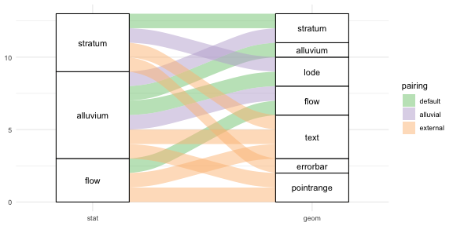

<!--
To generate `paper.md`, execute this from the console:
```r
knitr::knit("paper.rmd", "paper.md")
```
-->


# Summary

Alluvial diagrams use stacked bar plots and variable-width ribbons to represent multi-dimensional or repeated-measures data comprising categorical or ordinal variables [@Rosvall2010;@Bojanowski2016]. The ggalluvial package extends the layered grammar of graphics of ggplot2 [@Wickham2016] to generate alluvial diagrams from tidy data [@Wickham2014].

The package makes two key contributions to the R ecosystem.
First, ggalluvial anchors the imprecise notion of an alluvial diagram to the rigid grammar of graphics [@Wilkinson2006], which lends the plots more precise meaning and opens up many combinatorial possibilities.
Second, ggalluvial adopts a distinctive geological nomenclature to distinguish "alluvial plots" and their graphical elements from Sankey diagrams and parallel sets plots, which i hope prove useful as these visualization tools converge toward common standards.

## Functionality

[The titular vignette](http://corybrunson.github.io/ggalluvial/articles/ggalluvial.html) thoroughly describes and illustrates the functionality of ggalluvial, and the reader is encouraged to browse [the package documentation](http://corybrunson.github.io/ggalluvial/reference/index.html) for comprehensive examples. In brief, the package contains stat and geom functions to add the following layers to a ggplot2 object:

* _strata_, or stacked bar plots, located in parallel along a (plotting) axis of (variable) _axes_ or _dimensions_
* _alluvia_, ribbons through strata that connect the categories of individual cases or cohorts at different axes
* _lodes_, subdivisions of strata by their intersections with alluvia
* _flows_, segments of alluvia between strata

Plot layers are formed by pairing stats (statistical transformations) with geoms (mappings to graphical elements and properties); while every stat and geom has a conventional default, alternative grammatical pairings provide combinatorial richness to plotting possibilities.
The following alluvial plot depicts several meaningful stat--geom combinations from the documentation. Default pairings, other within-package ("alluvial") pairings, and pairings of alluvial stats with other geoms are differentiated by color:



Alluvial layers can interpret two forms of tidy data, long (one row per lode) and wide (one row per alluvium), related by the pivot operations of tidyr [@Wickham2019].
The alluvial stats require custom aesthetics---either `stratum` and/or `alluvium` in combination with `x`, if the data are in long format, or some number of axis specifications (`axis1`, `axis2`, etc.), if the data are in wide format.[^warnings] Because the alluvial geoms are specialized to these stats, no pairings with outside stats are currently supported.

[^warnings]: Because these aesthetics are not recognized by ggplot2, they produce warnings under some conditions.

Most of the stat parameters control how the strata at each axis, and the lodes within each stratum, are ordered vertically. By default, these orderings are independent of differentiation aesthetics, so that layers are consistent within and across plots unless otherwise specified. [An auxiliary vignette](http://corybrunson.github.io/ggalluvial/articles/order-rectangles.html) details the effects of these parameters. They can also be set as global options.

While questions and requests by users have prompted many improvements, the current version is feature complete with one exception: Alternative flow elements will be implemented and controlled by a new parameter. The current splines will remain the default.

## Concepts

Visualizations of flow processes have long encoded magnitudes as ribbon widths, constituting a type called Sankey diagrams [@Schmidt2008].
A widely-used subtype for longitudinal categorical data represent categories as nodes threaded by edges that represent the trajectories and magnitudes of cases [@Riehmann2005].
Their design anticipated parallel sets plots, which were adapted from parallel coordinates plots [@Inselberg1987;@Wegman1990] to visualize multivariate categorical data, and which represent cohorts of equivalent cases as ribbons connecting categories represented as boxes [@Kosara2006].
These in turn anticipated "alluvial diagrams", proposed to visualize changes in case memberships across successive cross-sections [@Rosvall2010].
Several R packages have been developed to generate these diagrams, in particular alluvial [@Bojanowski2016], ggparallel [@Hofmann2013], ggforce [@Pedersen2019], ggalluvial [@Brunson2019], and ggpcp [@Ge2019].

The diagrams produced by ggalluvial are statistical graphics in the sense that they communicate statistical information using graphical methods [@Friendly2005] and, more narrowly, are uniquely determined from data by a fixed set of plotting rules [@Wilkinson2006]. The package adopts for them the term _alluvial plot_.[^plots]
These plots are distinct from Sankey diagrams (they do not necessarily represent flow) and constitute a subtype of parallel sets plots distinguished by two features: a strict order on the stacked elements at each axis, including both the values of the discrete variables and the ribbons connecting cases or cohorts between them; and a meaningful positional dimension along which these elements are stacked, which precludes inserting gaps between them, features shared only by ggparallel.
The package includes several levers of control over the statistical transformations, and thereby over the messages conveyed by the plot.[^easy]
The plot elements are rendered by separate layers, following the additive (`+`) syntax of ggplot2, a feature shared only by ggpcp.

[^plots]: This has the unfortunate side effect of conflating search results from the geology literature.
[^easy]: Other ggplot2 extensions are not so flexible; in particular, the dependency package easyalluvial [@Koneswarakantha2019] was built on top of ggalluvial to exchange much of this flexibility for more expedient data exploration.

Sankey, parallel sets, and alluvial diagrams are often conflated, and there is currently no consensus on what features are distinctive to each type.
Moreover, their graphical elements go by a variety of names, often interchangeably.
While adopting new terms risks adding to this confusion, these alluvial plots are, i think, distinctive enough to warrant it.

## Applications

While most uses might be served equally well by other parallel sets plots or Sankey diagrams, ggalluvial seems exceptionally well-suited to three settings: repeated ordinal measures data, incomplete longitudinal data, and signed categorical data.[^opinion]

[^opinion]: To be sure, this is a subjective assessment that may be refuted by visualization effectiveness research.

**Repeated ordinal measures data:**
Most Sankey, parallel sets, and alluvial implementations stack each bar plot in order of name or of size, though some follow user-provided hierarchies, and most insert gaps between categories for easy visual discrimination. Ordinal variables are most appropriately stacked in their own intrinsic and consistent order and, when the number of categories changes from axis to axis, vertical separations can obscure whether magnitude totals changed as well. A use case by @Schlotter2019, to represent changes (or not) in patients' physical limitations following an investigational right heart valve repair technique, illustrates the use of an ordinal stratum variable (a heart failure functional classification). Another, by @North2019, to represent ranked preferences among several definitions of veganism by survey respondents, illustrates the importance of consistency in their order. In both cases, the fixed heights of the bar plots conveyed that no individuals were lost to follow-up.

**Incomplete longitudinal data:**
Alluvial plots clearly indicate times at which longitudinal data are censored or otherwise missing: Certain strata, or the alluvia or flows connecting them, are present at one time point but absent at a previous or future one.
@Seekatz2018 use this feature to include in one alluvial plot a sample of _Clostridium difficile_--infected patients who had their infections ribotyped at multiple times. Patients were classified by dominant ribotype, and the alluvial plot showcased variability in this classification. While all 32 patients had at least two samples taken, only 3 had four, communicated by the shortening of the bar plots along the dimensional axis.
@Sjoding2019 use a similar plot to trace patient groups receiving mechanical ventilation based on discretized tidal volumes, including a grey stratum for patients discontinued from intubation.

**Signed categorical data:**
@Edwards2019 produced a novel alluvial plot to represent changes in ownership category of owners in a halibut fishery. The total number of owners changed from year to year as exiters were not exactly matched by new entrants. In order to depict an accurate total but include both new entrants and exiters at each year, the authors affixed a negative stratum for the exiter category to each bar plot, reflected across the dimensional axis. Such a feature has no analogue in Sankey diagrams or parallel sets plots but potentially wide-ranging applications: Bar plots may use "positive" and "negative" bars to represent definitionally signed categories, such as contributors to revenue versus deficit, or to contrast the bars divided along a binary variable such as gender across age groups in a population ("pyramid plots"). Alluvial plots provide a way to track cases and cohorts across such graphics, even if cases change sign. Future use cases may demonstrate the practical utility of this functionality.

# Acknowledgments

I am grateful to many users for their feedback on every version of this package. Development benefitted from the use of resources and support of colleagues at UConn Health, and i have been supported in part by T90 training grant 5T90DE021989-07 from the National Institute of Dental and Craniofacial Research.

# References
